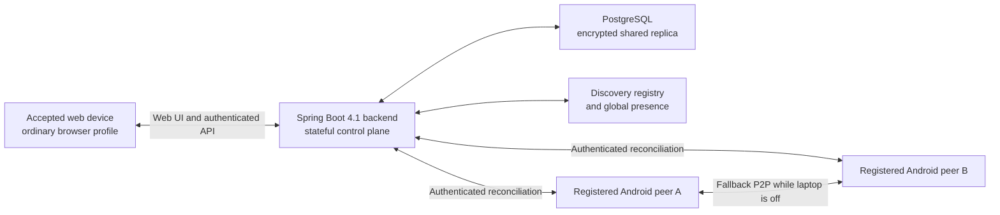
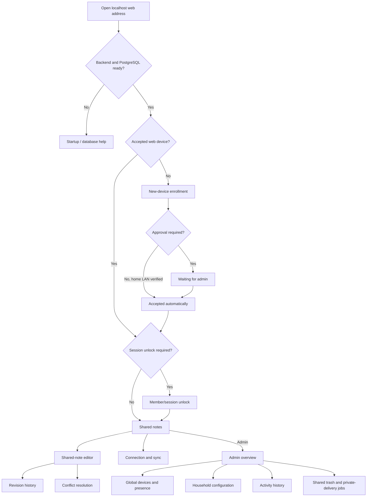
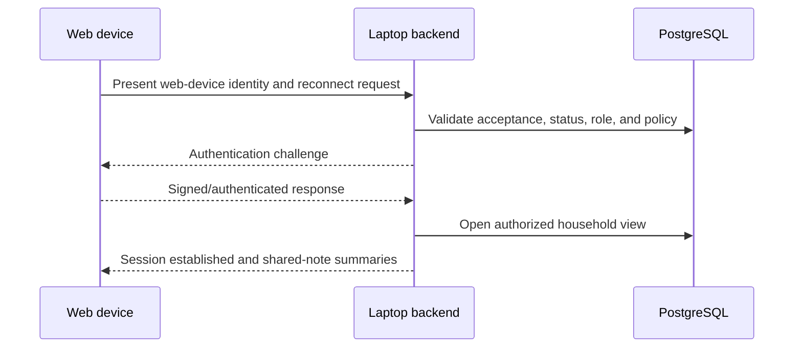
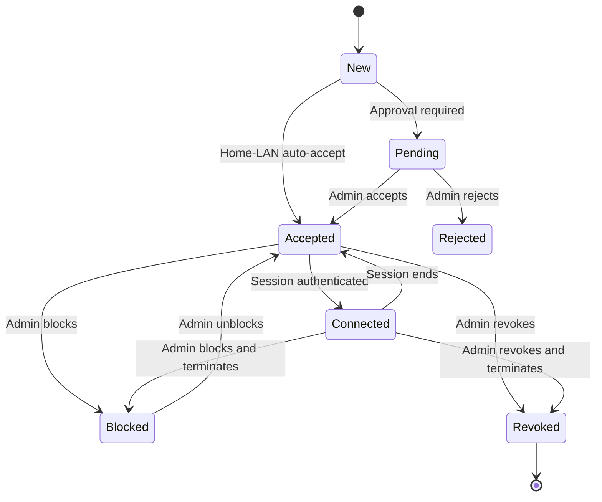
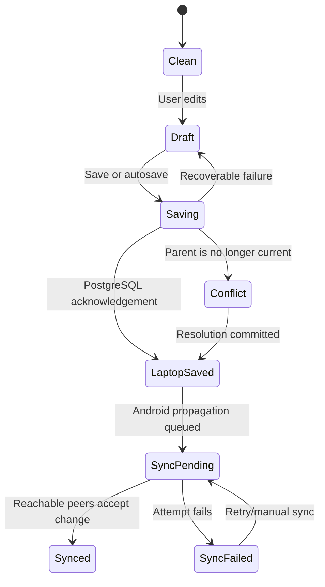
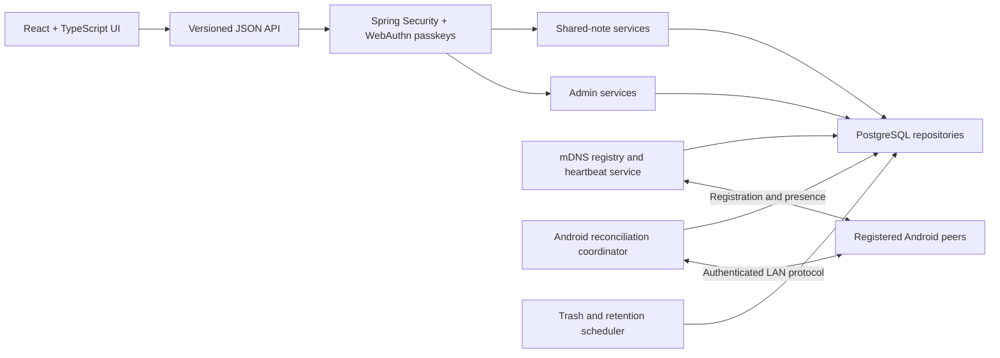
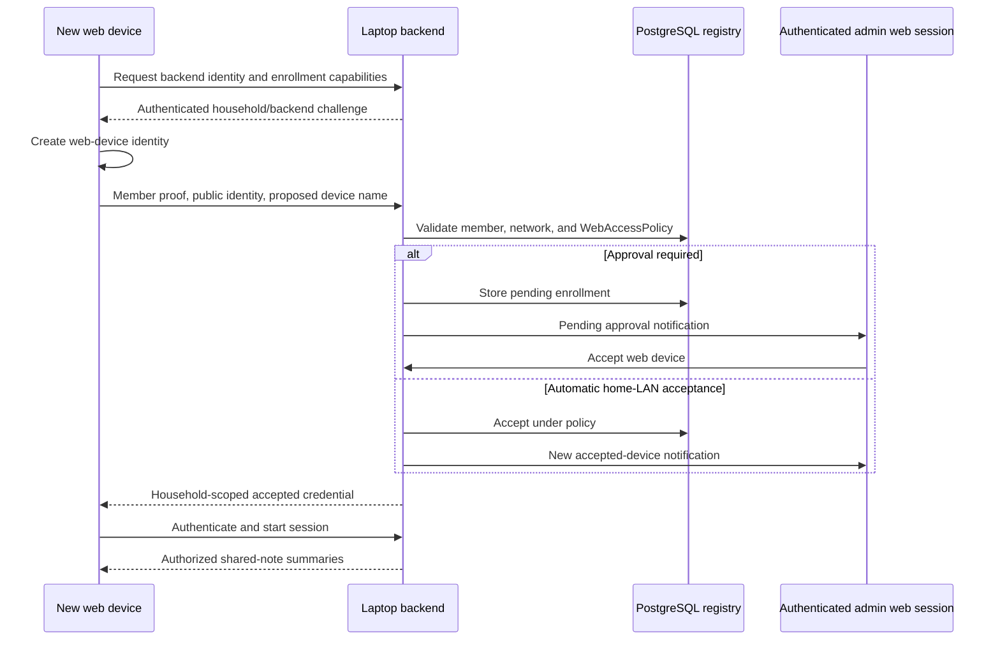

# NetBook Web Companion Product and Application Design

**Companion specifications:** [Web requirements](web-requirements.md), [Android design](design.md)
**Document status:** Version 1 interaction and technical design
**Last updated:** 2026-08-09
**Implementation repository:** this repository
**Backend runtime:** Spring Boot 4.1 on Java 21

## 1. Design goals

The web companion should feel like opening the family notebook on a laptop, not like configuring a network appliance. It should let a person move naturally between phone and laptop while preserving the local-first household model.

The experience must make four facts clear:

- The browser is connected to the stateful backend on the designated admin laptop.
- An accepted web device does not need repeated admin approval.
- `Saved to <device name>` and mobile propagation are different states.
- Web/admin access ends when the laptop backend or PostgreSQL stops, while Android note usage continues independently.

The browser is a temporary interface with a remembered identity. It is not an installed application, a permanent peer, or a separate note repository.

All household administration is implemented only in this web application. The Android app has no admin navigation, hidden admin routes, or privileged admin controls.

## 2. Product model



The backend hosts the frontend, authenticates browser sessions, owns the root-admin control plane, durably commits shared revisions to PostgreSQL, and reconciles them with Android peers. The browser sends commands with revision identifiers, receives sanitized view models, and retains only its device credential and non-sensitive preferences between sessions.

The backend runs on the designated admin laptop. Its root-admin UI binds to loopback by default. Android note editing and P2P synchronization continue when it is stopped, but web/admin/PostgreSQL/global-presence functions pause until restart.

## 3. Information architecture



## 4. Navigation and responsive structure

### 4.1 Laptop and desktop

Use a compact left navigation rail with:

- Notes
- Connection
- Admin, visible only to admins
- Current member and web-device menu

The notes workspace uses two panes when width allows:

- A searchable shared-note list.
- The selected note editor or viewer.

Revision and conflict views may add a third contextual pane on wide screens. The layout collapses before content becomes cramped.

### 4.2 Tablet and narrow windows

Use single-page navigation with a top app bar. The note list, editor, revisions, and conflicts become separate routes. All functionality remains available without requiring hover or a mouse.

### 4.3 Persistent status surface

While authenticated, the application shell shows a compact connection indicator:

- `Connected to <laptop device name>`
- `Saved to <laptop device name> · Mobile propagation pending`
- `2 household peers reachable`
- `Connection interrupted`

Status uses text and icons. It does not rely on green, amber, or red alone.

## 5. Core user journeys

### 5.1 First access when approval is required

1. The root admin starts Spring Boot and PostgreSQL on the designated laptop.
2. The backend initializes discovery, reconciliation, and the loopback web listener.
3. The member opens the backend address in a normal browser.
4. The browser creates a web-device identity and asks for a recognizable device name.
5. The member proves their existing household identity using an accepted member device or an admin-assisted flow.
6. The backend creates a pending request without disclosing notes.
7. An admin sees the request with member, proposed device name, and time.
8. The admin accepts or rejects it.
9. On acceptance, the browser stores its household-scoped credential and opens Shared notes.
10. Later sessions authenticate automatically and do not repeat approval.

### 5.2 First access when home-LAN acceptance is allowed

1. The first five steps are the same.
2. The backend verifies that enrollment is being offered on the household home LAN over the configured trusted listener.
3. The policy accepts the web device automatically.
4. Reachable admins receive a new-device notification.
5. The accepted device appears immediately in admin device management.

The interface must describe automatic acceptance honestly: anyone able to satisfy the member-association flow while on the permitted LAN may gain access under this policy.

### 5.3 Returning accepted web device



No approval prompt is shown. If policy requires member unlock, it happens after device authentication and is described as unlocking the session—not accepting the device again.

### 5.4 Edit and synchronize from a laptop

1. The member opens a shared note at revision `R17`.
2. The browser keeps the editable draft in page memory.
3. Save sends the note ID, new content, idempotency key, and parent revision `R17`.
4. The backend validates permissions and current revision state.
5. PostgreSQL commits `R18` durably and the backend acknowledges `Saved to <laptop device name>`.
6. The configured synchronization mode determines when the backend reconciles Android peers.
7. The browser updates household sync status independently of the save acknowledgement.

If PostgreSQL already contains a different child of `R17`, the backend returns a conflict result and preserves both candidates.

## 6. Page designs

### 6.1 Backend startup and connection page

**Purpose:** Explain how to start and reach the local laptop backend without presenting a cloud sign-in.

**States:**

- Backend and PostgreSQL ready.
- Backend stopped or PostgreSQL unavailable.
- Web listener disabled by configuration.
- Local-network permission denied.
- Friendly address unresolved; direct address offered.
- Unsupported or obsolete browser.
- Secure-origin validation failed.

**Content:**

- NetBook identity.
- `Start NetBook on this laptop` explanation.
- Short steps for checking the Spring Boot process, PostgreSQL, configured localhost port, and discovery listener.
- Retry action.
- Browser-specific troubleshooting only after a failure is detected.

No household name, member data, or note preview is disclosed before the backend session is authenticated.

### 6.2 New web-device enrollment page

**Purpose:** Establish a recognizable web-device identity once.

**Content:**

- Member-association action.
- Editable device name supplied by the registered device, such as `Family Laptop`.
- Device type: `LAPTOP` or `MOBILE`.
- Device platform: `WEB`, `ANDROID`, or `IPHONE`.
- Explanation: `This browser will be remembered on this profile. You will not need approval each time.`
- Privacy warning for shared or public computer profiles.
- Continue and cancel actions.

**Pending state:**

- Proposed member and device name.
- Request time.
- Current laptop backend.
- `Waiting for an admin to accept this device`.
- Cancel and retry controls.

The page must not repeatedly create requests when reloaded. It reuses the same pending identity and request ID.

### 6.3 Session unlock page

**Purpose:** Reauthenticate a member when required without implying that the device is untrusted.

**Content:**

- Accepted web-device name.
- Household and member identity.
- `Use passkey` action for an admin session or fresh sensitive-action reauthentication.
- `This device is already accepted` reassurance.
- Use another member or forget-this-device path, when permitted.

The React client requests a WebAuthn challenge from Spring Boot, invokes the browser credential API, and returns the assertion for server-side verification. There is no password field or password fallback in version 1. Root-admin setup registers the first passkey before admin routes become usable.

### 6.4 Shared-notes home

**Purpose:** Provide a simple laptop-first family notebook.

**Layout:**

- Search field with filter selector.
- Filters: `Title`, `Created by`, `Last edited by`, `Modified date`, and `Conflict state`.
- Sort: recently modified, created, or title.
- Shared-note rows with title, preview, last editor, modified time, conflict badge, and save/sync status.
- The first 20 matching notes, followed by `Show more` when another page exists; each activation appends at most 20.
- `New shared note` primary action.
- Connection banner only when action is required.

There is no Private filter in web version 1. The page explicitly labels the collection `Shared notes` so absence of private notes is not mistaken for data loss.

Search applies to all authorized current shared notes, not merely the rows already loaded in React. Changing search text, filters, or sort clears the current rows and requests a new first page. The API uses an opaque cursor for later pages. Spring Boot may decrypt authorized note summaries transiently in memory to apply filters, but neither PostgreSQL nor the browser stores a plaintext search index.

**Empty states:**

- No shared notes yet.
- Search has no matches.
- PostgreSQL migration or peer reconciliation is still loading current shared state.
- Current device is accepted but blocked or session access has expired.

### 6.5 Shared-note editor

**Purpose:** Create and safely edit plain-text shared notes.

**Content:**

- Title.
- Plain-text body.
- Current revision and last-editor summary.
- PostgreSQL commit state.
- Household-sync state.
- Revision history.
- Role-appropriate overflow actions.

**Save states:**

- `Editing`
- `Saving to <laptop device name>`
- `Saved to <laptop device name>`
- `Sync pending`
- `Synchronized with reachable peers`
- `Connection interrupted — draft kept in this tab`
- `Conflict`
- `Save failed`

Save may be explicit or debounced autosave, but a tab must never close silently while its latest content lacks a PostgreSQL commit acknowledgement.

Admins see `Move to trash` and `Move to private device…` under an explicit menu. Private delivery selects an eligible Android device owned by the admin, waits for durable acknowledgement, and only then moves the shared source to trash.

### 6.6 Revision history

**Content:**

- Retained revisions in PostgreSQL.
- Author member, origin web/Android device, and time.
- Current, restored, and conflict labels.
- Read-only preview or difference view.
- `Restore as new revision` action.

The page states that history is limited by household retention and what has reconciled to PostgreSQL.

### 6.7 Conflict resolution

Use side-by-side panes on a wide laptop and sequential panes on narrow screens. Show:

- Web-device or Android-device source.
- Member, origin device, and save time.
- Each title and body.
- `Use this version`, `Use other version`, and `Combine manually`.

Saving the resolution produces one new revision naming all conflict parents.

### 6.8 Connection and synchronization page

**Purpose:** Explain the three relevant layers without network jargon.

| Layer | Example status |
|---|---|
| Browser session | `Connected to <laptop device name>` |
| PostgreSQL commit | `All edits saved to <laptop device name>` |
| Mobile propagation | `1 change waiting; 2 devices globally connected` |

**Content:**

- Current web-device name and short ID.
- Current backend and PostgreSQL health.
- Session duration and idle timeout.
- Reachable household-peer count.
- Pending shared revisions, conflicts, and failures.
- Last successful household sync.
- Configured sync mode.
- `Sync now`, `Disconnect`, and diagnostics actions.

The page says `No pending changes known to the laptop`, never `Everything is on every device`.

### 6.9 Admin overview

**Summary:**

- Registered Android devices.
- Accepted web devices.
- Android peers connected now.
- Web sessions connected now.
- Pending web-device approvals.
- Blocked or revoked devices.
- Unresolved conflicts and recent sync failures.

Recent activity includes web acceptance, connection, block, revoke, note edit, and sync events. The existing eventual-consistency banner remains visible.

### 6.10 Admin connected-device management

**Device groups:**

- Connected now.
- Accepted but offline.
- Pending approval.
- Blocked.
- Revoked.

**Web-device row:**

- Member and role.
- Device display name.
- `Web` type badge and stable short ID.
- Accepted automatically or by admin.
- Accepted time and last seen.
- Backend session start and latest discovery heartbeat when online.
- Status.

**Actions:**

- Accept or reject pending request.
- Rename.
- End current session.
- Block or unblock.
- Revoke.

`End session` is temporary. `Block` prevents access until reversed. `Revoke` invalidates remembered acceptance and requires fresh enrollment.

### 6.11 Admin web-access policy

**Settings:**

- Enable web access for the household.
- Permit or pause new Android-device enrollment.
- Android enrollment: `Open on home LAN` or `Admin approval required`.
- Permit new web-device enrollment.
- New-device acceptance:
  - `Admin approval required`
  - `Automatically accept on home LAN`
- Accepted web-device network scope:
  - `Home LAN only`
  - `Trusted HTTPS on the home LAN` (disabled by default)
- Session idle timeout.
- Concurrent sessions per web device.
- Admin reauthentication interval; destructive and key-management actions always reauthenticate.
- Registered passkeys with friendly name, created/last-used time, `Add passkey`, and `Remove`; removal cannot leave the root admin with zero usable passkeys.
- Web-triggered sync:
  - `After each save` — default
  - `Periodic while connected`
  - `Manual only`
- Periodic interval when applicable.
- Saved revisions per note — default 5.
- Admin activity retention — default 100 days.
- Shared trash retention — default 30 days.
- Admin-role membership, while preserving at least one admin.

**Interaction rules:**

- Explain that accepted devices do not need approval again.
- Preview which active sessions will be affected.
- Do not disconnect accepted devices merely because new enrollment is disabled.
- Require admin reauthentication for security-sensitive reductions.
- Record a versioned `WEB_ACCESS_POLICY_CHANGED` event.

Encryption, conflict preservation, private-note exclusion, required audit events, destructive confirmations, and the absence of Android admin controls are fixed security rules—not settings.

### 6.12 Admin activity history

Extend filters with:

- Origin type: Android or Web.
- Web device.
- Laptop backend and Android origin device when applicable.
- Web lifecycle: approval, session, block, or revoke.

Example rows:

- `<laptop device name> was accepted automatically on the home LAN.`
- `<laptop device name> opened Shopping List.`
- `<laptop device name> disconnected after 20 minutes of inactivity.`
- `Admin revoked Guest Browser.`

### 6.13 Admin shared-note trash and private delivery

**Purpose:** Keep destructive shared-note operations recoverable and make a shared-to-private move explicit.

**Content:**

- Active shared notes with an admin action to `Move to trash`.
- Trashed notes with trashing admin, time, purge deadline, `Restore`, and `Permanently purge`.
- Private-delivery jobs with initiating admin, owned Android target, requested time, acknowledgement status, retryable failure, and cancellation.
- Current trash-retention policy and a link to configuration.

Moving a note to private is coordinated, not a database visibility toggle: the selected Android device must create an encrypted device-local copy and acknowledge it. Only then does the backend move the shared source to trash. Timeout or failure leaves the shared note active.

## 7. State and interaction model

### 7.1 Web-device lifecycle



`Offline` is a presentation state for an accepted device without a current session, not a separate authorization state.

### 7.2 Note-edit state



The browser may display multiple compatible states, such as `Saved to <laptop device name> · Mobile propagation failed`.

## 8. Laptop full-stack technical design

### 8.1 Repository and build boundaries

Frontend and backend live in one repository:

The root of this repository.

Recommended structure for the React and Spring Boot implementation:

```text
netbook/
├── pom.xml
├── frontend/
│   ├── package.json
│   ├── package-lock.json      # Or one consistently selected package-manager lockfile
│   ├── index.html
│   ├── vite.config.ts
│   └── src/                   # React, TypeScript, routes, UI, API client
├── src/main/java/             # Spring Boot API, security, services, repositories
├── src/main/resources/
│   ├── application.yaml       # Every configuration key/default/bound
│   └── db/migration/          # Flyway PostgreSQL migrations
└── docs/                      # Web API, deployment, and operating notes
```

React with TypeScript is the version 1 UI choice. Vite builds the frontend, and the Maven production lifecycle invokes the pinned frontend build and packages its output as Spring Boot static assets. During development, Vite may run separately and proxy `/api` to Spring Boot. Browser code owns presentation and transient draft state; Spring Boot remains authoritative for authentication, authorization, persistence, pagination, filtering, and administrative commands.

### 8.2 Components



Spring Boot controls sessions, root-admin authorization, configuration, shared-data persistence, discovery, global presence, reconciliation, retention, and admin commands. Android retains its local repositories and P2P protocol so laptop downtime does not block notes. Both sides use the same immutable revision, conflict, tombstone, and idempotency rules.

#### 8.2.1 React application boundaries

React uses route-level code splitting and these route groups:

```text
/auth/passkey
/notes
/notes/:noteId
/notes/:noteId/history
/conflicts/:noteId
/connection
/admin
/admin/devices
/admin/activity
/admin/shared-notes
/admin/settings
```

- `SessionProvider` holds the current sanitized member, web-device, role, CSRF state, and backend availability in memory.
- `MemberRoute` requires an authenticated accepted web-device session.
- `AdminRoute` additionally requires the server-reported admin role; hiding a route is never the authorization boundary.
- `NotesPage` composes `NoteSearchFilters`, `NoteList`, `NoteRow`, and `ShowMoreButton`.
- `NoteEditorPage` owns the unsaved draft in component state and displays separate PostgreSQL-save and Android-propagation indicators.
- Admin pages are lazy-loaded, but every API operation is independently authorized by Spring Security.
- A typed API client handles JSON decoding, CSRF headers, idempotency keys, standardized errors, and cancellation. It does not persist response bodies.
- Version 1 does not require Redux. React component/context state is sufficient for UI state, while PostgreSQL and backend endpoints own durable/server state.

### 8.3 Backend and PostgreSQL lifecycle

- Spring Boot and PostgreSQL run on the designated admin laptop.
- Startup validates configuration, secrets, database connectivity, and Flyway migrations before admin routes become ready.
- The admin HTTP listener binds to loopback by default. Device discovery/reconciliation uses a separate authenticated LAN protocol listener.
- After startup, discovery accepts authenticated heartbeats and reconciliation imports/exports missing immutable changes.
- Graceful shutdown stops admin commands first, drains database work, then stops discovery.
- During downtime, Android continues local and P2P work. On restart, the backend reconstructs presence from new heartbeats and reconciles data.
- PostgreSQL is a complete shared replica, not a browser session cache.

### 8.4 Browser persistence

Allowed persistent data:

- Household-scoped web-device ID.
- Non-exportable or protected browser credential where supported.
- Device display name.
- Non-sensitive display preferences.
- Protocol and schema version.

Disallowed persistent data in version 1:

- Note titles, bodies, previews, search indexes, or revision content.
- Household shared-data keys.
- Admin activity payloads.
- Long-lived session bearer tokens.

Clearing allowed data makes the browser profile a new web device; it does not delete any PostgreSQL or Android note.

### 8.5 API and command shape

Every mutating request includes:

- Authenticated web-device ID.
- Member and role context resolved by Spring Security and PostgreSQL.
- Session ID.
- Globally unique idempotency key.
- Expected policy version when relevant.
- Note and parent revision IDs for note saves.

The backend returns structured outcomes such as:

- `committed`
- `unchanged`
- `conflict`
- `not_authorized`
- `device_blocked`
- `session_expired`
- `policy_changed`
- `storage_failed`

Retrying the same idempotency key cannot create a second revision or activity event.

### 8.6 Canonical `application.yaml` design

Every version 1 deployment setting and every admin-editable default/bound has a YAML key; there shall be no hidden code-only defaults. Admin-editable values use these as defaults and bounds, while effective overrides are stored in PostgreSQL. Secrets are environment placeholders.

```yaml
spring:
  application:
    name: netbook
  datasource:
    url: ${NETBOOK_DB_URL:jdbc:postgresql://localhost:5432/netbook}
    username: ${NETBOOK_DB_USER:netbook}
    password: ${NETBOOK_DB_PASSWORD}
    hikari:
      maximum-pool-size: 10
      minimum-idle: 2
      connection-timeout: 10s
  flyway:
    enabled: true
  jpa:
    open-in-view: false

server:
  address: 127.0.0.1
  port: 8080
  shutdown: graceful

netbook:
  node:
    role: ROOT_ADMIN_LAPTOP
    id: ${NETBOOK_NODE_ID}
    auto-start-discovery: true
  web:
    enabled: true
    root-admin-loopback-only: true
    lan-access-enabled: false
    lan-bind-address: 0.0.0.0
    lan-port: 8443
    lan-https-required: true
    tls-certificate-ref: ${NETBOOK_TLS_CERT_REF:}
    tls-private-key-ref: ${NETBOOK_TLS_KEY_REF:}
  security:
    master-key-ref: ${NETBOOK_MASTER_KEY_REF}
    signing-key-ref: ${NETBOOK_SIGNING_KEY_REF}
    content-cipher: AES_256_GCM
    key-provider: OS_KEYSTORE
    admin-reauthentication: 5m
    authentication-max-failures: 5
    authentication-lockout: 15m
    passkeys:
      enabled: true
      relying-party-id: ${NETBOOK_PASSKEY_RP_ID:localhost}
      relying-party-name: NetBook
      allowed-origins:
        - ${NETBOOK_PASSKEY_ORIGIN:http://localhost:8080}
      user-verification: REQUIRED
      attestation: NONE
      challenge-timeout: 2m
      max-credentials-per-admin: 5
  home-lan:
    profile-ref: ${NETBOOK_HOME_LAN_PROFILE_REF}
  discovery:
    enabled: true
    service-type: _netbook._tcp.local.
    bind-address: 0.0.0.0
    port: 7843
    heartbeat-interval: 15s
    offline-after: 45s
    stale-after: 24h
  enrollment:
    android-enabled: true
    android-mode: OPEN_ON_HOME_LAN
    web-enabled: true
    web-mode: ADMIN_APPROVAL_REQUIRED
    request-retention: 7d
  synchronization:
    web-trigger-mode: AFTER_EACH_SAVE
    reconciliation-interval: 30s
    batch-size: 200
    command-timeout: 60s
  history:
    note-revisions-default: 5
    note-revisions-min: 1
    note-revisions-max: 100
    activity-retention-default: 100d
    activity-retention-min: 1d
    activity-retention-max: 3650d
  trash:
    retention-default: 30d
    retention-min: 1d
    retention-max: 365d
    purge-cron: "0 0 3 * * *"
  sessions:
    idle-timeout-default: 30m
    idle-timeout-min: 5m
    idle-timeout-max: 12h
    absolute-timeout: 24h
    max-concurrent-per-web-device: 2
  private-delivery:
    acknowledgement-timeout: 5m
    job-retention: 30d
    require-owned-device: true
  roles:
    delegated-admin-can-grant-admin: false
  audit:
    page-size-default: 100
    page-size-max: 500
  notes-list:
    page-size-default: 20
    page-size-max: 20
    scan-batch-size: 200
    cursor-ttl: 5m
    search-fields:
      - TITLE
      - CREATED_BY
      - LAST_EDITED_BY
      - MODIFIED_DATE
      - CONFLICT_STATE
    plaintext-search-index-enabled: false
```

`application.yaml` must contain no literal database password, master key, private signing key, TLS private key, or recovery secret. Empty TLS references are valid only while LAN web access is disabled. The configuration page shows effective values and their YAML/environment/database source without revealing secret values. Adding a future configurable behavior requires adding its typed key, default or required placeholder, validation bounds, and documentation here before implementation.

### 8.7 Shared-note list API

The React home page calls a versioned endpoint such as:

```http
GET /api/v1/shared-notes?limit=20&cursor=opaque&title=shopping&createdBy=member-id&lastEditedBy=member-id&modifiedFrom=...&modifiedTo=...&conflict=true&sort=MODIFIED_DESC
```

The response contains at most 20 sanitized note summaries and an opaque `nextCursor` only when more matches exist. The cursor binds the authorized member, normalized filters, sort order, and a bounded listing snapshot; it is signed or stored server-side and cannot be used to infer database keys. Changing any filter starts a new cursor sequence.

For version 1 household scale, Spring Boot obtains authorized encrypted summaries in bounded batches, decrypts them only in process memory, applies the requested filters, and fills the page. It returns no private or trashed notes and stores no plaintext title/body index. Resource limits in `application.yaml` prevent an unbounded decrypt-and-filter request.

React API requests use an `HttpOnly`, `SameSite` session cookie and a server-issued CSRF token. The application does not store session bearer tokens or note pages in `localStorage` or IndexedDB.

## 9. Enrollment and session protocol

### 9.1 New-device enrollment



No note summary is returned before the acceptance branch completes.

### 9.2 Returning session

The laptop backend validates:

1. Household and protocol version.
2. Web-device credential proof.
3. Accepted, blocked, and revoked status.
4. Member status and current role.
5. Web-access and session policy.
6. Replay protection and session freshness.

Only then does it expose routes carrying household data.

## 10. Synchronization behavior

### 10.1 After each save

After acknowledging a durable PostgreSQL commit, the backend queues immediate Android reconciliation. The browser may continue editing while propagation proceeds.

### 10.2 Periodic while connected

The backend commits every browser save immediately but batches Android reconciliation at the configured interval. A manual `Sync now` remains available.

### 10.3 Manual only

The backend commits browser saves and marks them `Android propagation pending`. It contacts peers only for explicit synchronization or a security-critical revocation/key update. Android-to-Android synchronization remains independently automatic.

### 10.4 Laptop outage and recovery

There is one root control-plane backend in version 1. If it stops, the browser keeps only an unacknowledged draft in page memory and shows reconnect instructions; it does not fail over to an Android web gateway. Android devices continue local editing and authenticated P2P synchronization.

After restart, the backend:

1. Opens PostgreSQL and validates migrations and keys.
2. Rebuilds live presence from authenticated device heartbeats.
3. Reconciles missing immutable revisions, conflicts, policies, tombstones, and activity events with reachable Android peers.
4. Reloads the browser note's current PostgreSQL revision before accepting a preserved draft.
5. Uses the draft's parent revision and idempotency key to save safely or return a conflict.

## 11. Security design and release gate

### 11.1 Security layers

- Authenticate the laptop backend origin before household data is trusted.
- Authenticate the accepted web device before household data is disclosed.
- Authenticate admin sessions and sensitive reauthentication with WebAuthn passkeys; do not provide a password fallback.
- Bind sessions to short lifetimes and replay-resistant challenges.
- Apply role and device-status checks to every command.
- Encrypt sensitive PostgreSQL columns or payload envelopes under keys protected outside the database, and retain the Android repository's device-local encryption model.
- Serve no third-party executable content.
- Apply strict content security, origin, framing, referrer, MIME, and cache policies.
- Keep note content out of URLs, persistent browser caches, crash reports, and normal diagnostics.
- Validate passkey relying-party ID, allowed origin, challenge, credential status, user verification, and replay resistance on the server.

### 11.2 Secure-origin decision

A privileged browser requires an authenticated trustworthy origin. Version 1 resolves this for the root laptop by binding the admin UI to `127.0.0.1` and using `http://localhost`, which browsers treat as a potentially trustworthy loopback origin. The LAN device protocol remains a separate mutually authenticated listener and never serves the admin UI.

Access from another computer or mobile browser remains disabled by default because:

- A raw local HTTP response can be changed by a malicious LAN participant, including the JavaScript responsible for encryption.
- Encrypting API messages inside JavaScript does not repair compromised JavaScript delivery.
- A per-device self-signed HTTPS certificate is not silently trusted by ordinary browsers.
- Installing a local certificate authority or helper conflicts with the no-installation requirement.
- Loading the application shell from a public HTTPS host conflicts with strict no-internet first use unless it was previously cached.

Spring Boot can terminate HTTPS, but certificate trust for a LAN-only hostname remains unresolved. Non-local browser access must not be enabled until a trusted HTTPS mechanism is selected and verified across supported browsers. Warning bypasses and untrusted self-signed certificates are not acceptable release mechanisms.

### 11.3 Threat boundaries

- Web-device acceptance trusts the security of that browser profile and operating-system user account.
- Automatic home-LAN acceptance is convenience, not proof of a person's identity.
- Android peers report offline activity as cooperating devices; the audit view is not forensic proof.
- Revocation prevents future sessions but cannot recall content already viewed or copied.

## 12. Browser compatibility strategy

- Build the core experience on stable HTML, CSS, JavaScript, fetch/streaming, and browser cryptography capabilities with explicit feature detection.
- Maintain a test matrix for current Chrome, Edge, Firefox, and Safari rather than displaying a browser choice during onboarding.
- Treat friendly hostname resolution as optional and always retain a direct-address path.
- Detect local-network permission failure and show targeted recovery steps.
- Do not depend on PWA installation, periodic background sync, push notifications, or a permanently running service worker.
- Use progressive enhancement for side-by-side layouts, richer differences, and convenience features only.

## 13. Error and edge-state design

| Condition | User-facing behavior |
|---|---|
| Laptop backend or PostgreSQL stops | Keep an unacknowledged draft in tab memory, disable commands, and offer reconnect; Android remains operational. |
| Browser credential missing | Treat as a new web device; do not expose notes. |
| Device awaiting approval | Show one stable pending request without revealing notebook data. |
| Device blocked | End the session and identify that an admin must unblock it. |
| Device revoked | End the session, discard credential, and require new enrollment. |
| Passkeys unsupported or user verification unavailable | Do not offer a password fallback; explain that an available WebAuthn authenticator is required for administration. |
| Passkey assertion cancelled or rejected | Preserve the non-admin session, deny the privileged action, and allow an explicit retry. |
| Every root-admin passkey is unavailable | Administration remains locked; version 1 has no automated recovery path. |
| Admin disables new enrollment | Accepted devices may reconnect; new devices receive a clear policy message. |
| PostgreSQL save succeeds but mobile propagation fails | Show `Saved to <laptop device name> · Mobile propagation failed` with retry. |
| Parent revision is outdated | Preserve draft and open conflict resolution. |
| `Show more` request fails | Keep already loaded rows, retain the cursor, and show a retry action without duplicating notes. |
| Search filters change during a request | Cancel or ignore the stale response and load a fresh first page of 20. |
| Browser tab closes with unsaved text | Warn before leaving; never claim the draft was saved. |
| Localhost address fails | Show backend startup, configured port, and PostgreSQL diagnostics. |
| Local-network permission denied | Explain how to grant it in the current browser/OS. |
| Secure origin cannot be established | Do not load real note data; show a security diagnostic. |
| Backend role state is stale | Reconcile policy/security state before permitting admin action. |

## 14. Accessibility and content direction

- Use familiar note language; reserve networking terminology for diagnostics.
- Announce connection, save, sync, and conflict changes through accessible live regions without excessive repetition.
- Keep focus stable when autosave status changes.
- Provide labeled keyboard actions for creating, saving, searching, opening history, and disconnecting.
- Present conflict versions in a deterministic reading order.
- Name destructive actions with their targets.
- Avoid showing raw IP addresses until the friendly connection method fails or the user opens technical details.

## 15. Implementation slices

1. Spring Boot 4.1, Java 21, React, TypeScript, Vite, PostgreSQL, Flyway, and a loopback-only production foundation with real configured identity and a manual acceptance checklist.
2. Root-admin passkey bootstrap, Spring Security WebAuthn verification, OS-protected key reference, database lifecycle, and localhost secure-origin proof.
3. Authenticated Android discovery, device registry, heartbeat presence, and reconciliation protocol.
4. Web-device identity, acceptance policy, remembered reconnect, and admin global-device view.
5. PostgreSQL-backed shared-note list with 20-row cursor pagination and filters, viewer, editor, and durable idempotent revision save.
6. Android propagation status, backend outage/restart reconciliation, and conflict handling.
7. Revision history, activity history, trash/restore/purge, and coordinated shared-to-private delivery.
8. Policy controls, delegated web-admin roles, block/revoke/session termination, accessibility, and full browser matrix verification. Backup/restore remains deferred.

Each slice must preserve PostgreSQL as the laptop's complete shared replica while keeping Android local repositories and P2P synchronization operational without the backend. Unit tests are not required by the current product decision, but completion must be demonstrated through each slice's manual acceptance checklist.
